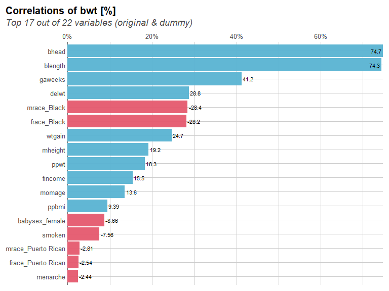
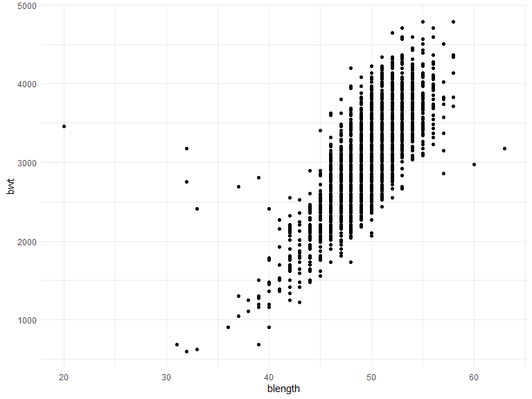
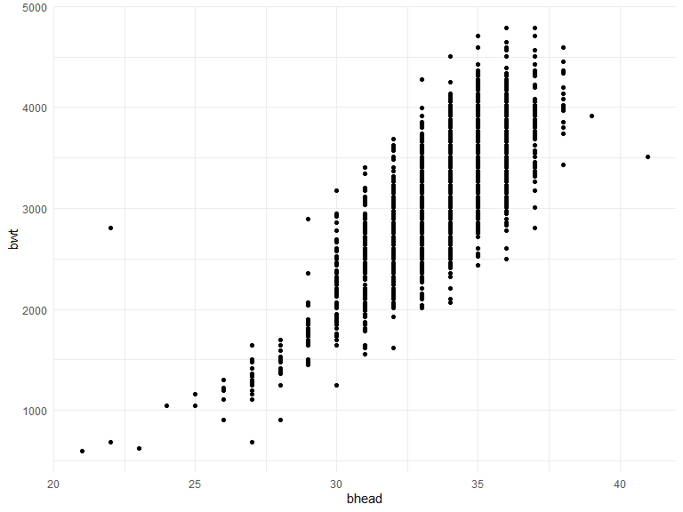
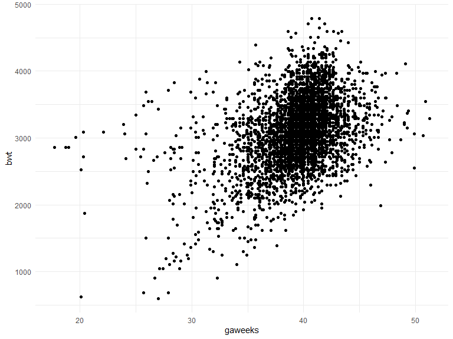
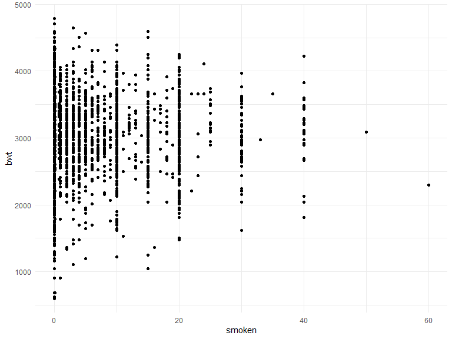
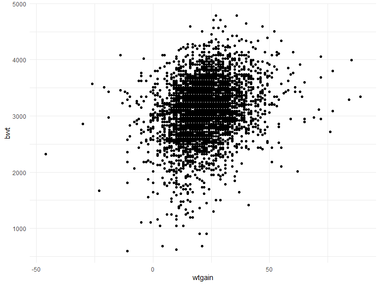
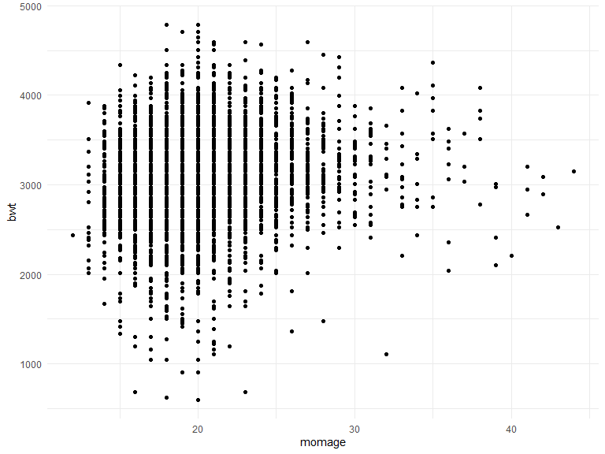
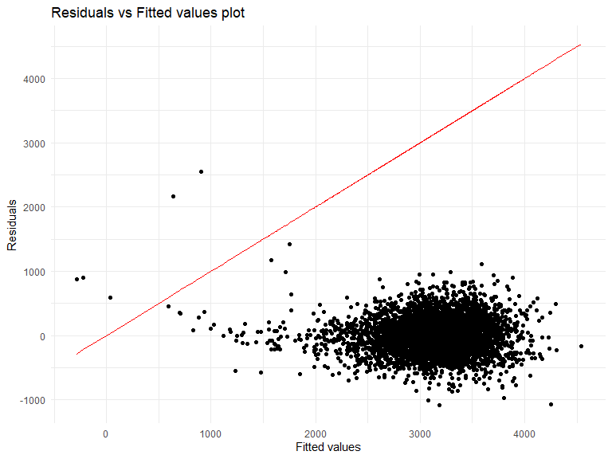
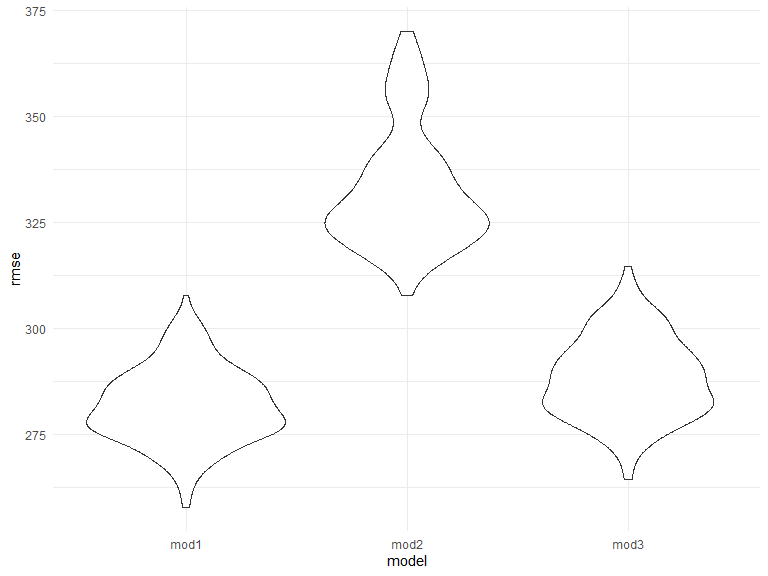

Untitled
================
Wuraola Olawole
12/6/2020

``` r
knitr::opts_chunk$set(
    echo = TRUE,
    warning = FALSE,
    fig.width = 8, 
  fig.height = 6,
  out.width = "90%"
)
options(
  ggplot2.continuous.colour = "viridis",
  ggplot2.continuous.fill = "viridis"
)
scale_colour_discrete = scale_colour_viridis_d
scale_fill_discrete = scale_fill_viridis_d
theme_set(theme_minimal() + theme(legend.position = "bottom"))
```

### Problem 1

``` r
homicide_df = 
  read_csv("data/homicide-data.csv", na = c("", "NA", "Unknown")) %>% 
  mutate(
    city_state = str_c(city, state, sep = ", "),
    victim_age = as.numeric(victim_age),
    resolution = case_when(
      disposition == "Closed without arrest" ~ 0,
      disposition == "Open/No arrest"        ~ 0,
      disposition == "Closed by arrest"      ~ 1)
  ) %>% 
  filter(
    victim_race %in% c("White", "Black"),
    city_state != "Tulsa, AL") %>% 
  select(city_state, resolution, victim_age, victim_race, victim_sex)
```

    ## 
    ## -- Column specification --------------------------------------------------------
    ## cols(
    ##   uid = col_character(),
    ##   reported_date = col_double(),
    ##   victim_last = col_character(),
    ##   victim_first = col_character(),
    ##   victim_race = col_character(),
    ##   victim_age = col_double(),
    ##   victim_sex = col_character(),
    ##   city = col_character(),
    ##   state = col_character(),
    ##   lat = col_double(),
    ##   lon = col_double(),
    ##   disposition = col_character()
    ## )

Start with one city.

``` r
baltimore_df =
  homicide_df %>% 
  filter(city_state == "Baltimore, MD")
glm(resolution ~ victim_age + victim_race + victim_sex, 
    data = baltimore_df,
    family = binomial()) %>% 
  broom::tidy() %>% 
  mutate(
    OR = exp(estimate),
    CI_lower = exp(estimate - 1.96 * std.error),
    CI_upper = exp(estimate + 1.96 * std.error)
  ) %>% 
  select(term, OR, starts_with("CI")) %>% 
  knitr::kable(digits = 3)
```

| term              |    OR | CI\_lower | CI\_upper |
| :---------------- | ----: | --------: | --------: |
| (Intercept)       | 1.363 |     0.975 |     1.907 |
| victim\_age       | 0.993 |     0.987 |     1.000 |
| victim\_raceWhite | 2.320 |     1.648 |     3.268 |
| victim\_sexMale   | 0.426 |     0.325 |     0.558 |

Try this across cities.

``` r
models_results_df = 
  homicide_df %>% 
  nest(data = -city_state) %>% 
  mutate(
    models = 
      map(.x = data, ~glm(resolution ~ victim_age + victim_race + victim_sex, data = .x, family = binomial())),
    results = map(models, broom::tidy)
  ) %>% 
  select(city_state, results) %>% 
  unnest(results) %>% 
  mutate(
    OR = exp(estimate),
    CI_lower = exp(estimate - 1.96 * std.error),
    CI_upper = exp(estimate + 1.96 * std.error)
  ) %>% 
  select(city_state, term, OR, starts_with("CI")) 
```

``` r
models_results_df %>% 
  filter(term == "victim_sexMale") %>% 
  mutate(city_state = fct_reorder(city_state, OR)) %>% 
  ggplot(aes(x = city_state, y = OR)) + 
  geom_point() + 
  geom_errorbar(aes(ymin = CI_lower, ymax = CI_upper)) + 
  theme(axis.text.x = element_text(angle = 90, hjust = 1))
```


## Problem 2

Find some residuals

``` r
baby_df = 
  read_csv("./data/birthweight.csv") %>%
  janitor::clean_names() %>%
  mutate(
    babysex = as_factor(babysex),
    frace = as_factor(frace),
    mrace = as_factor(mrace),
    malform = as_factor(malform)
  ) %>%
  drop_na()
```

    ## 
    ## -- Column specification --------------------------------------------------------
    ## cols(
    ##   .default = col_double()
    ## )
    ## i Use `spec()` for the full column specifications.

``` r
baby_df %>% 
  ggplot(aes(x = bwt)) + geom_density()
```



``` r
ggplot(baby_df, aes(blength, bwt)) + geom_point()
```



``` r
ggplot(baby_df, aes(bhead,bwt)) + geom_point()
```



``` r
ggplot(baby_df, aes(gaweeks, bwt)) + geom_point()
```



``` r
ggplot(baby_df, aes(smoken, bwt)) + geom_point()
```



``` r
ggplot(baby_df, aes(wtgain, bwt)) + geom_point()
```



``` r
ggplot(baby_df, aes(momage,bwt)) + geom_point()
```



One using length at birth and gestational age as predictors (main
effects only) One using head circumference, length, sex, and all
interactions (including the three-way interaction) between these

``` r
mod1 = 
      lm(bwt ~ blength + bhead + gaweeks + smoken + wtgain + momage , data = baby_df )
summary(mod1)
```

    ## 
    ## Call:
    ## lm(formula = bwt ~ blength + bhead + gaweeks + smoken + wtgain + 
    ##     momage, data = baby_df)
    ## 
    ## Residuals:
    ##      Min       1Q   Median       3Q      Max 
    ## -1087.88  -187.29    -5.64   175.16  2552.86 
    ## 
    ## Coefficients:
    ##               Estimate Std. Error t value Pr(>|t|)    
    ## (Intercept) -6126.5317    96.4559 -63.516  < 2e-16 ***
    ## blength        79.4755     2.0650  38.486  < 2e-16 ***
    ## bhead         134.8996     3.4976  38.569  < 2e-16 ***
    ## gaweeks        13.2289     1.4991   8.825  < 2e-16 ***
    ## smoken         -2.3704     0.5830  -4.066 4.86e-05 ***
    ## wtgain          3.8383     0.4041   9.497  < 2e-16 ***
    ## momage          7.4388     1.1256   6.608 4.35e-11 ***
    ## ---
    ## Signif. codes:  0 '***' 0.001 '**' 0.01 '*' 0.05 '.' 0.1 ' ' 1
    ## 
    ## Residual standard error: 282 on 4335 degrees of freedom
    ## Multiple R-squared:  0.6972, Adjusted R-squared:  0.6968 
    ## F-statistic:  1664 on 6 and 4335 DF,  p-value: < 2.2e-16

``` r
broom::tidy(mod1)
```

    ## # A tibble: 7 x 5
    ##   term        estimate std.error statistic   p.value
    ##   <chr>          <dbl>     <dbl>     <dbl>     <dbl>
    ## 1 (Intercept) -6127.      96.5      -63.5  0.       
    ## 2 blength        79.5      2.07      38.5  5.04e-279
    ## 3 bhead         135.       3.50      38.6  4.63e-280
    ## 4 gaweeks        13.2      1.50       8.82 1.57e- 18
    ## 5 smoken         -2.37     0.583     -4.07 4.86e-  5
    ## 6 wtgain          3.84     0.404      9.50 3.46e- 21
    ## 7 momage          7.44     1.13       6.61 4.35e- 11

``` r
broom::glance(mod1)
```

    ## # A tibble: 1 x 12
    ##   r.squared adj.r.squared sigma statistic p.value    df  logLik    AIC    BIC
    ##       <dbl>         <dbl> <dbl>     <dbl>   <dbl> <dbl>   <dbl>  <dbl>  <dbl>
    ## 1     0.697         0.697  282.     1664.       0     6 -30655. 61326. 61377.
    ## # ... with 3 more variables: deviance <dbl>, df.residual <int>, nobs <int>

``` r
baby_df %>%
  add_residuals(mod1) %>%
  add_predictions(mod1) %>%
   ggplot(aes(x = pred, y = resid)) + geom_point() +
  geom_line(aes(y = pred), col = 'red') + 
  labs(title = "Residuals vs Fitted values plot",
       x = "Fitted values",
       y = "Residuals")
```



``` r
mod2 =
      lm(bwt~ blength + gaweeks, data = baby_df)
  
mod3 =
      lm(bwt~ bhead + blength + babysex + bhead*blength + bhead*babysex + babysex*blength + babysex*blength*bhead, data = baby_df)
```

``` r
cv_df = 
  crossv_mc(baby_df, 100) %>%
  mutate(
    train = map(train, as_tibble),
    test = map(test, as_tibble))
```

Fit candidate models

``` r
mod_com_df = 
  cv_df %>% 
  mutate(
    mod_1  = map(train, ~lm(bwt ~ blength + bhead + gaweeks + smoken, data = .x)),
    mod_2  = map(train, ~lm(bwt~ blength + gaweeks, data = .x)),
    mod_3  = map(train, ~lm(bwt~ bhead + blength + babysex + bhead*blength + 
                      bhead*babysex + babysex*blength + babysex*blength*bhead, data = .x))) %>% 
  mutate(
    rmse_mod1 = map2_dbl(mod_1, test, ~rmse(model = .x, data = .y)),
    rmse_mod2 = map2_dbl(mod_2, test, ~rmse(model = .x, data = .y)),
    rmse_mod3 = map2_dbl(mod_3, test, ~rmse(model = .x, data = .y)))
```

``` r
mod_com_df %>% 
  select(starts_with("rmse")) %>% 
  pivot_longer(
    everything(),
    names_to = "model", 
    values_to = "rmse",
    names_prefix = "rmse_") %>% 
  mutate(model = fct_inorder(model)) %>% 
  ggplot(aes(x = model, y = rmse)) + geom_violin()
```


