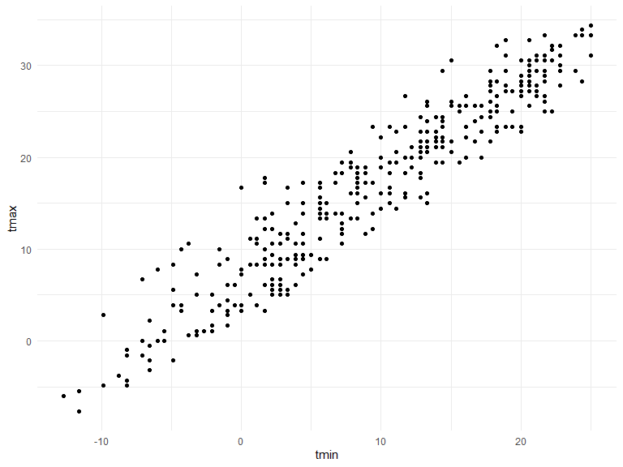
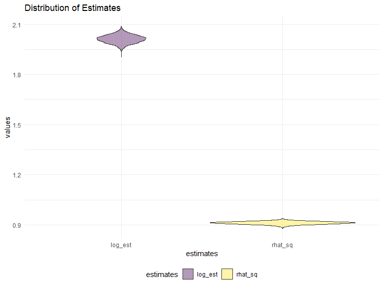

Homework 6\!
================
Wuraola Olawole
12/6/2020

``` r
knitr::opts_chunk$set(
    echo = TRUE,
    warning = FALSE,
    fig.width = 8, 
  fig.height = 6,
  out.width = "90%"
)
options(
  ggplot2.continuous.colour = "viridis",
  ggplot2.continuous.fill = "viridis"
)
scale_colour_discrete = scale_colour_viridis_d
  scale_fill_discrete = scale_fill_viridis_d
    theme_set(theme_minimal() + theme(legend.position = "bottom"))
```

### Problem 1

``` r
homicide_df = 
  read_csv("data/homicide-data.csv", na = c("", "NA", "Unknown")) %>% 
  mutate(
    city_state = str_c(city, state, sep = ", "),
    victim_age = as.numeric(victim_age),
    resolution = case_when(
      disposition == "Closed without arrest" ~ 0,
      disposition == "Open/No arrest"        ~ 0,
      disposition == "Closed by arrest"      ~ 1)
  ) %>% 
  filter(
    victim_race %in% c("White", "Black"),
    city_state != "Tulsa, AL") %>% 
  select(city_state, resolution, victim_age, victim_race, victim_sex)
```

Start with one city.

``` r
baltimore_df =
      homicide_df %>% 
        filter(city_state == "Baltimore, MD")
          glm(resolution ~ victim_age + victim_race + victim_sex, 
    data = baltimore_df,
      family = binomial()) %>% 
        broom::tidy() %>% 
  mutate(
    OR = exp(estimate),
    CI_lower = exp(estimate - 1.96 * std.error),
    CI_upper = exp(estimate + 1.96 * std.error)
  ) %>% 
  select(term, OR, starts_with("CI")) %>% 
    knitr::kable(digits = 3)
```

| term              |    OR | CI\_lower | CI\_upper |
| :---------------- | ----: | --------: | --------: |
| (Intercept)       | 1.363 |     0.975 |     1.907 |
| victim\_age       | 0.993 |     0.987 |     1.000 |
| victim\_raceWhite | 2.320 |     1.648 |     3.268 |
| victim\_sexMale   | 0.426 |     0.325 |     0.558 |

Across cities.

``` r
models_results_df = 
  homicide_df %>% 
    nest(data = -city_state) %>% 
  mutate(
    models = 
      map(.x = data, ~glm(resolution ~ victim_age + victim_race + victim_sex, data = .x, family = binomial())),
    results = map(models, broom::tidy)
        ) %>% 
  select(city_state, results) %>% 
    unnest(results) %>% 
      mutate(
              OR = exp(estimate),
              CI_lower = exp(estimate - 1.96 * std.error),
              CI_upper = exp(estimate + 1.96 * std.error)
            ) %>% 
  select(city_state, term, OR, starts_with("CI")) 
```

``` r
models_results_df %>% 
  filter(term == "victim_sexMale") %>% 
    mutate(city_state = fct_reorder(city_state, OR)) %>% 
      ggplot(aes(x = city_state, y = OR)) + 
        geom_point() + 
      geom_errorbar(aes(ymin = CI_lower, ymax = CI_upper)) + 
        theme(axis.text.x = element_text(angle = 90, hjust = 1))
```


## Problem 2

Load and clean data, convert some class numeric to factor, check NA

``` r
baby_df = 
  read_csv("./data/birthweight.csv") %>%
    janitor::clean_names() %>%
      mutate(
              babysex = as_factor(babysex),
              frace = as_factor(frace),
              mrace = as_factor(mrace),
              malform = as_factor(malform)
            ) 
  
Chk_NA = is.na(baby_df) 
# no NAs!
```

Explore distribution of outcome (bwt) visually

``` r
baby_df %>% 
  ggplot(aes(x = bwt)) + geom_density()
```


Explore visually the relationship between outcome and candidate
predictors

``` r
p1 = ggplot(baby_df, aes(blength, bwt)) + geom_point()
  p2 = ggplot(baby_df, aes(bhead,bwt)) + geom_point()
    p3 = ggplot(baby_df, aes(gaweeks, bwt)) + geom_point()
      
    p4 = ggplot(baby_df, aes(smoken, bwt)) + geom_point()
        p5 = ggplot(baby_df, aes(wtgain, bwt)) + geom_point()
          p6 = ggplot(baby_df, aes(momage,bwt)) + geom_point()

(p1 + p2 + p3) / (p4 + p5 + p6)
```


fit model with predictors explored previously

``` r
# H0 = There is no significant linear relationship between the outcome (bwt) and predictors, Bo = 0
# H1 = There is a significant linear relationship between the outcome and the predictors, Bo ≠ 0

mod1 = 
      lm(bwt ~ blength + bhead + gaweeks + smoken + wtgain + momage , data = baby_df )
        summary(mod1)
```

    ## 
    ## Call:
    ## lm(formula = bwt ~ blength + bhead + gaweeks + smoken + wtgain + 
    ##     momage, data = baby_df)
    ## 
    ## Residuals:
    ##      Min       1Q   Median       3Q      Max 
    ## -1087.88  -187.29    -5.64   175.16  2552.86 
    ## 
    ## Coefficients:
    ##               Estimate Std. Error t value Pr(>|t|)    
    ## (Intercept) -6126.5317    96.4559 -63.516  < 2e-16 ***
    ## blength        79.4755     2.0650  38.486  < 2e-16 ***
    ## bhead         134.8996     3.4976  38.569  < 2e-16 ***
    ## gaweeks        13.2289     1.4991   8.825  < 2e-16 ***
    ## smoken         -2.3704     0.5830  -4.066 4.86e-05 ***
    ## wtgain          3.8383     0.4041   9.497  < 2e-16 ***
    ## momage          7.4388     1.1256   6.608 4.35e-11 ***
    ## ---
    ## Signif. codes:  0 '***' 0.001 '**' 0.01 '*' 0.05 '.' 0.1 ' ' 1
    ## 
    ## Residual standard error: 282 on 4335 degrees of freedom
    ## Multiple R-squared:  0.6972, Adjusted R-squared:  0.6968 
    ## F-statistic:  1664 on 6 and 4335 DF,  p-value: < 2.2e-16

``` r
          broom::tidy(mod1)
```

    ## # A tibble: 7 x 5
    ##   term        estimate std.error statistic   p.value
    ##   <chr>          <dbl>     <dbl>     <dbl>     <dbl>
    ## 1 (Intercept) -6127.      96.5      -63.5  0.       
    ## 2 blength        79.5      2.07      38.5  5.04e-279
    ## 3 bhead         135.       3.50      38.6  4.63e-280
    ## 4 gaweeks        13.2      1.50       8.82 1.57e- 18
    ## 5 smoken         -2.37     0.583     -4.07 4.86e-  5
    ## 6 wtgain          3.84     0.404      9.50 3.46e- 21
    ## 7 momage          7.44     1.13       6.61 4.35e- 11

``` r
            broom::glance(mod1)
```

    ## # A tibble: 1 x 12
    ##   r.squared adj.r.squared sigma statistic p.value    df  logLik    AIC    BIC
    ##       <dbl>         <dbl> <dbl>     <dbl>   <dbl> <dbl>   <dbl>  <dbl>  <dbl>
    ## 1     0.697         0.697  282.     1664.       0     6 -30655. 61326. 61377.
    ## # ... with 3 more variables: deviance <dbl>, df.residual <int>, nobs <int>

``` r
              qt(0.95, 4335)
```

    ## [1] 1.645205

``` r
aov(mod1)
```

    ## Call:
    ##    aov(formula = mod1)
    ## 
    ## Terms:
    ##                   blength     bhead   gaweeks    smoken    wtgain    momage
    ## Sum of Squares  629354727 146465932   7667503    818743   6094422   3473378
    ## Deg. of Freedom         1         1         1         1         1         1
    ##                 Residuals
    ## Sum of Squares  344777488
    ## Deg. of Freedom      4335
    ## 
    ## Residual standard error: 282.0167
    ## Estimated effects may be unbalanced

``` r
  summary(aov(mod1))
```

    ##               Df    Sum Sq   Mean Sq F value   Pr(>F)    
    ## blength        1 629354727 629354727 7913.08  < 2e-16 ***
    ## bhead          1 146465932 146465932 1841.56  < 2e-16 ***
    ## gaweeks        1   7667503   7667503   96.41  < 2e-16 ***
    ## smoken         1    818743    818743   10.29  0.00134 ** 
    ## wtgain         1   6094422   6094422   76.63  < 2e-16 ***
    ## momage         1   3473378   3473378   43.67 4.35e-11 ***
    ## Residuals   4335 344777488     79533                     
    ## ---
    ## Signif. codes:  0 '***' 0.001 '**' 0.01 '*' 0.05 '.' 0.1 ' ' 1

``` r
    qf(0.95, 6, 4335)
```

    ## [1] 2.100678

Exploring the results above, all the relationships were significant and
we reject the null hypothesis and conclude that there is a significant
linear relationship between the predictors and the outcome. Sidenote:
the p\_values were significant as well.

Plot residuals against fitted values

``` r
baby_df %>%
  add_residuals(mod1) %>%
    add_predictions(mod1) %>%
      select(bwt, blength, bhead , gaweeks , smoken , wtgain , momage, resid, pred) %>%
  
 ggplot(aes(x = pred, y = resid)) +
  geom_point(size = 2) +
    geom_smooth(aes(colour = pred, fill = pred)) + 
                geom_hline(yintercept = 0) +
  
  labs(title = "Residuals vs Fitted values plot",
       x = "Fitted values",
       y = "Residuals")
```

    ## `geom_smooth()` using method = 'gam' and formula 'y ~ s(x, bs = "cs")'


The modeling process I employed involved visualizing the distribution of
the outcome. Looked up some literature to explore already proven
relationships between outcome and some predictors.I explored the visual
relationships between the outcome and my predictors of interest.
Proposed an hypothesis, fitted a model and tested the hypothesis to
explore that there truly was a relationship between my outcome and
predictors.

fit one model using length at birth and gestational age as predictors
(main effects only) fit another model using head circumference, length,
sex, and all interactions (including the three-way interaction) between
these

``` r
mod2 =
      lm(bwt~ blength + gaweeks, data = baby_df)

mod3 =
      lm(bwt~ bhead + blength + babysex + bhead*blength + bhead*babysex + babysex*blength + babysex*blength*bhead, data = baby_df)
```

Cross validation\!

``` r
cv_df = 
  crossv_mc(baby_df, 200) %>%
    mutate(
          train = map(train, as_tibble),
          test = map(test, as_tibble))
```

Fit candidate models and obtain RMSEs\!

``` r
mod_com_df = 
  cv_df %>% 
    mutate(
          mod_1  = map(train, ~lm(bwt ~ blength + bhead + gaweeks + smoken + wtgain + momage, data = .x)),
          mod_2  = map(train, ~lm(bwt~ blength + gaweeks, data = .x)),
          mod_3  = map(train, ~lm(bwt~ bhead + blength + babysex + bhead*blength + 
                      bhead*babysex + babysex*blength + babysex*blength*bhead, data = .x))) %>% 
  mutate(
        rmse_mod1 = map2_dbl(mod_1, test, ~rmse(model = .x, data = .y)),
        rmse_mod2 = map2_dbl(mod_2, test, ~rmse(model = .x, data = .y)),
        rmse_mod3 = map2_dbl(mod_3, test, ~rmse(model = .x, data = .y)))
```

Compare models. (Sidenote: RMSE has the range of outcome)

``` r
mod_com_df %>% 
  select(starts_with("rmse")) %>% 
    pivot_longer(
                everything(),
                names_to = "model", 
                values_to = "rmse",
                names_prefix = "rmse_") %>% 
  
  mutate(model = fct_inorder(model)) %>% 
    ggplot(aes(x = model, y = rmse)) + geom_violin() +
      labs(title = "Comparison of Models")
```


## problem 3

Load weather dataset

``` r
weather_df = 
    rnoaa::meteo_pull_monitors(
      c("USW00094728"),
      var = c("PRCP", "TMIN", "TMAX"), 
      date_min = "2017-01-01",
      date_max = "2017-12-31") %>%
  mutate(
        name = recode(id, USW00094728 = "CentralPark_NY"),
        tmin = tmin / 10,
        tmax = tmax / 10) %>%
  select(name, id, everything())
```

Visual exploration\!

``` r
weather_df %>% 
  ggplot(aes(x = tmin, y = tmax)) + 
    geom_point() 
```



5000 bootstrap samples fitting slr for tmax and tmin

``` r
bootstr =
    weather_df %>% 
      modelr::bootstrap(n = 5000) %>% 
        mutate(
              models = map(strap, ~ lm(tmax ~ tmin, data = .x)),
              glance = map(models, broom::glance),
              results = map(models, broom::tidy)) %>% 
  
  select(results, glance) %>% 
    unnest(results, glance) %>%
      mutate(term = str_replace(term,"\\(Intercept\\)","Intercept"))
```

obtaining estimates, tidying and cleaning

``` r
est =
  bootstr %>%
      select(term, estimate, r.squared) %>%
        pivot_wider(
                  names_from = "term",
                  values_from = "estimate"
                  ) %>%
  janitor::clean_names() %>%
    rename(rhat_sq = r_squared) %>%
      mutate(
            log_est = log(intercept * tmin)
              ) %>%
  select(-intercept, -tmin)

est
```

    ## # A tibble: 5,000 x 2
    ##    rhat_sq log_est
    ##      <dbl>   <dbl>
    ##  1   0.899    2.04
    ##  2   0.913    2.00
    ##  3   0.931    1.98
    ##  4   0.917    1.97
    ##  5   0.915    2.01
    ##  6   0.917    2.01
    ##  7   0.917    2.00
    ##  8   0.911    1.97
    ##  9   0.908    2.02
    ## 10   0.905    2.00
    ## # ... with 4,990 more rows

visualization of distribution

``` r
est %>%
  pivot_longer(1:2,
               names_to = "estimates",
               values_to = "values") %>%
  ggplot(aes(x = estimates, y = values, fill = estimates)) + 
    geom_violin(alpha = 0.4) +
      labs( title = "Distribution of Estimates")
```



Both estimates had a normal curve. R-hat squared had a tall and skinny
curve while the log estimate had a short and fat curve. This signifies
that R-hat squared had a lesser standard deviation compared with log
estimate.

95% confidence interval for both estimates

``` r
est %>%
  pivot_longer(1:2,
               names_to = "estimates",
               values_to = "values") %>% 
  group_by(estimates) %>% 
    summarize(
            ci_lower = quantile(values, 0.025), 
            ci_upper = quantile(values, 0.975), mean = mean(values), st_dev = sd(values))
```

    ## `summarise()` ungrouping output (override with `.groups` argument)

    ## # A tibble: 2 x 5
    ##   estimates ci_lower ci_upper  mean  st_dev
    ##   <chr>        <dbl>    <dbl> <dbl>   <dbl>
    ## 1 log_est      1.96     2.06  2.01  0.0241 
    ## 2 rhat_sq      0.894    0.927 0.911 0.00852

We can expect the true pop parameters of these estimates to fall within
these intervals.
